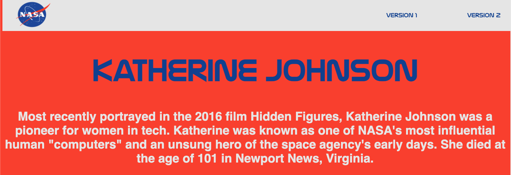
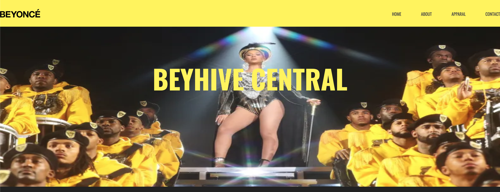

# Tribute Page
Who inspires you? Is it a celebrity or someone famous? Is it a character from literature or film? Is it someone from your family? In this lab, you'll be creating a page as a tribute to this person!
## The Goal
Design a page with your current knowledge of HTML and CSS leading your design! 
## The Lab
For this lab, you're starting with a basic HTML shell and a pre-linked stylesheet. You really get to be creative on this one, so think big! Keep reading for more details and specifications...
### The Details
Your page should include the following information about the person whom you've selected:
* Their Name
* Years Active (Ex: 1906-1975)
* A brief summary of who they are and the context for your selection (why did you choose this person?)
* A picture/pictures of your tributee
* A timeline with important dates/information about your tributee
* (If applicable) A link to an external site where readers can learn more about this person
#### **Version One: HTML**
Start your lab by simply getting information on the page, organized in a way that will suit your readers. Your page should include: 
* An HTML skeleton (HTML, Head, Body)
* At least **two** different header elements
* Paragraph elements
* At least **one** image element
* A list (ordered or unordered)
* An anchor element linking to another page (if applicable)

For a sample of what your Version 1 might look like, see below:

#### **Version Two: HTML & CSS**

Before beginning Version 2 of this page, you should assign IDs and/or classes to different elements on your Version 1 template before beginning to focus on style! This will allow you to customize specific components of the page with unique CSS.

Now that you've got some HTML written, time to add the style! Think about some or all of the following:
* Background Color
* Text Size/Weight/Alignment/Color
* Whitespace (Padding & Margins)
* Font 
* Image Size/Position

For a sample of what your Version 1 might look like, see below:

#### **Version Three: CSS (The Next Level)**
Feeling like a challenge? Revamp your page using CSS Grids to create structure and organization that helps guide your reader. We don't cover CSS Grids as part of our curriculum, so this is truly a **spicy** challenge!

If you haven't already done so, you may also want to consider:
* Google Fonts
* Coolors.co color palettes

For a sample of what your Version 3 might look like, see below:

For another sample of a Version 3 project, check out these images from a Beyonce fan page, created with CSS Grids.

